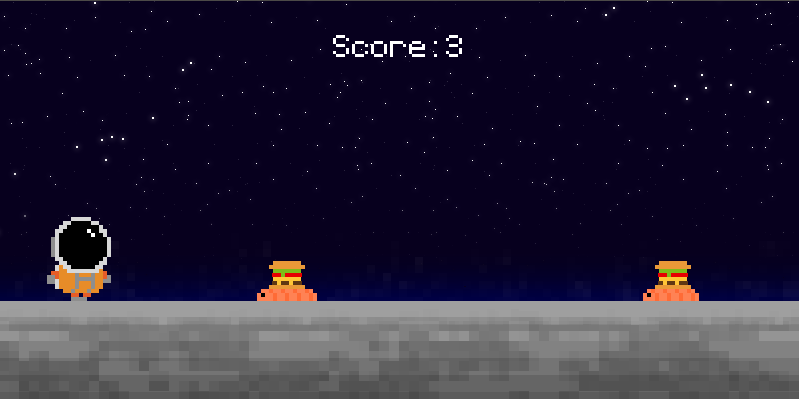

# Runner Tutorial
Welcome to my journey of discovering pygame for the first time!

_By [Veerle B](https://github.com/VeerleIB)_

## Overview
  - [Sources](#sources)
  - [Learned](#learned)
  - [Future improvements](#future-improvements)

## Sources
Thru this learning process, I've relied on tutorials, documentation and community forums to keep myself sane. 

List of resources:
- [The ultimate introduction to Pygame](https://www.youtube.com/watch?v=AY9MnQ4x3zk_)
- [Pygame documentation](https://www.pygame.org/docs/)

## Learned
I've learned a ton, thankfully! Among the 2 Python project i've tackled so far, this one stands out as the most challenging to date. Learning a new module like Pygame added an extra layer, pushing me to learn and tackle the fundamentals of coding even more.

#### Here's a quick list of what i've learned: 
- The basics of Pygame libary
  * Rendering the screen, working with surfaces, utilizing rects for positioning and collision detection, managing timers, implementing simple animations, and much more.
- Enhancing core concepts
  * Usage of variables, understanding of new methods; len, randint and choice, introduction to classes.

While some of these concepts may still feel a bit shaky, the exposure to new techniques has improved my understanding immensily. And like everyone experiences when learning something new: _“The more I know, the more I realize I know nothing.”_

## Future improvements
Not that many expect more features to add/test out.
